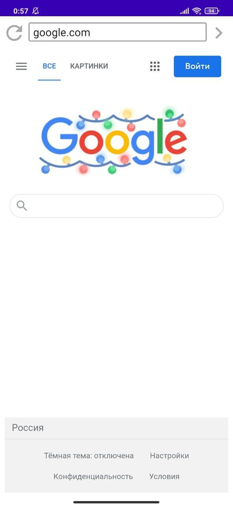
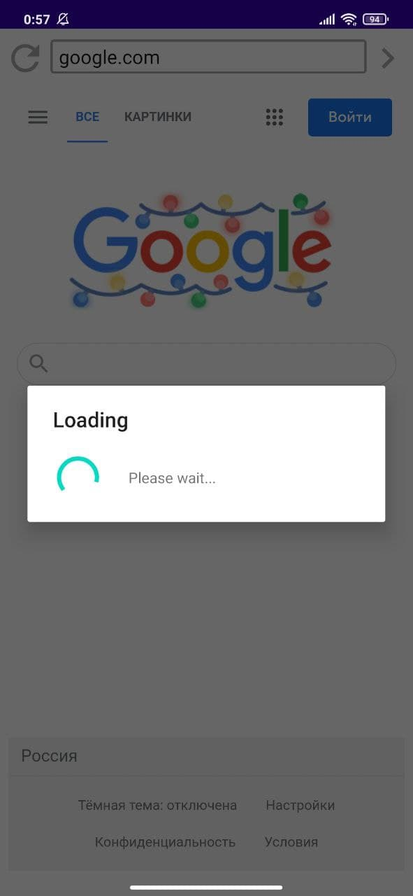

# physical-browser

**Physical browser** представляет собой Android приложение-браузер, предоставляющий web-приложениям доступ к контексту смартфона.

В приложении реализованы поисковая строка, кнопки _Next_ и _Refresh_ и компонент _WebView_. Кнопка Next отображают страницу, введенную в поисковую строку. Кнопка Refresh обновляет текущую страницу.

К _WebView_ привязывается _androidInterface_ - объект класса _JavascriptInterfaceImpl_, через который web-приложения могут взаимодействовать с физическим окружением устройства. Javascript код web-приложения может вызывать функции androidInterface как напрямую, так и через предлагаемое API, предназначенное для облегчение web-разработки.
Ссылка на physical-browser-api: [a link](https://github.com/Anna-Sl/physical-browser-api).

Скриншоты браузера:

{:height="50%" width="50%"} {:height="50%" width="50%"}

При первом запуске приложение запрашивает "разрешение на доступ к данным о расположении устройства".
**Важно!** Физическая функциональность работает только при одновременно включенном Wi-Fi и GPS.

Cайты, не использующие physical-browser-api, в Physical browser работают. Проверено на google.com, vk.com, youtube.com, wildberries.ru.

Для демонстрации использования physical-browser-api создан сайт “Faculty CMC checker” (Ссылка: [a link](https://github.com/Anna-Sl/cmc-checker)). 
